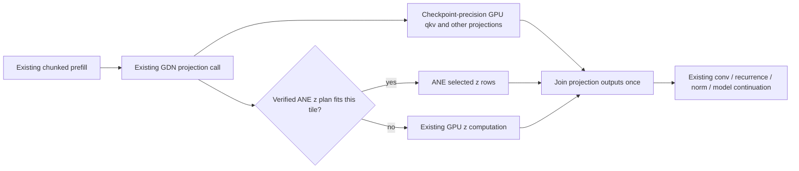

# ANE-assisted long-context prefill design

Status: proposed for review; implementation has not started. Date: 2026-09-06.

## Outcome and scope

Reduce cold and partially cached 32K–45K prompt latency for Qwen3.6-35B-A3B-Escha-W2 on the base M4 / 32 GiB, preserving usable capacity, cancellation, durable sessions, and task correctness. Deliver a small Higgs contribution that upstream can review and reproduce. Nanobot keeps its existing provider contract.

The measured starting point is 45,003 actual prompt tokens, 467.320 s reported prefill, 96.28 processed tok/s, 475.795 s request time, 3/3 retrieval anchors, 17.96 GiB peak sampled process footprint, normal pressure and no new swap-outs. This one synthetic run establishes feasibility, not a representative performance distribution or quality evaluation.

## Choices

| Approach | Decision | Reason |
|---|---|---|
| Whole-model ANE prefill | Exclude from this contribution | W2 expert representation, recurrent state and dynamic long attention would require several unproved changes at once. |
| GPU optimization only | Required control and possible final outcome | Current serial GDN and expert-kernel history show isolated wins can disappear end-to-end. Measure long-position costs before attributing them to a particular operator. |
| Concurrent GPU + selected ANE projection | Recommended experiment | Reuse existing Higgs work; accelerate one token-local operation inside the normal forward path. Integration proceeds only after measured benefit. |

## Reuse, with provenance

- `feat/magic-canvas`, relevant commit `89141aa6e`: public-CoreML INT8 dense-MLP prefill. Extract the model-package ownership/error handling and compile/load concepts from `ane_mlmodel.rs`, `qwen3_next_ane.rs`, loader hooks, and `benchmarks/ane_int8_mlpackage_probe/`. Its predecessor's 2.23x gate-projection result was Carnice-9B on M4 Max, not Escha on base M4.
- `feat/ane-prefill`, `cd78076c3`: private-API zero-copy GDN prototype. Reuse buffer-lifetime and layout lessons; do not merge either historical branch wholesale.
- The dirty `loving-matsumoto` worktree contains additional CoreML probes. Its engine integration targets the DFlash drafter, not wired qkvz prefill. Preserve those edits.
- [oMLX PR3133](https://github.com/jundot/omlx/pull/3133): approximate recurrent qkv offload caused long-context failures. Its corrected design keeps qkv at checkpoint precision and offloads token-local z. It reports a matched 22.7% throughput improvement at 32K on M3 Ultra; this is not a prediction for our Mac or checkpoint.
- [Cider experiment](https://github.com/Mininglamp-AI/cider/blob/main/experimental/README.md): concurrent channel splitting improved its M4 projection workload, but the authors report no end-to-end advantage with their current lazy-evaluation integration. Scheduling and transfers belong inside the measured boundary.

## Architecture: one forward path

The picture is a dependency graph, not permission to insert host synchronization at every edge. The implementation must submit independent GPU work before waiting on ANE and preserve normal MLX graph scheduling. Timing the hybrid path includes materialization, packing, submission, waiting and merge.

Initial target: the actual checkpoint's token-local GDN `z` projection, at batch 1 and a 1,024-token tile. Recurrent q/k/v, a/b dynamics, convolution, recurrence, attention, routed native W2 experts and decode retain their existing implementation and weight precision. A z-only improvement can still alter later hidden states; this is approximate inference and needs full-model behavioral evaluation. No claim of bit-exact generation is made.

Current `GatedDeltaNet` supports separate projections and combined per-head layouts. Eligibility must come from the loader's actual layout metadata and quantization specification, including fused projection ordering. Never copy oMLX's 37.5% split or its dimensions into Higgs. Test row selection against labeled synthetic weights and actual Escha weights. If a supported exact row mapping cannot be derived, retain GPU execution.

To save work, GPU execution must exclude the rows assigned to ANE. Computing the full fused qkvz on GPU and then overwriting z is a correctness scaffold only, never a performance candidate. Compare against the existing fused GPU baseline, not an artificially unfused baseline. Start with one tile width, one worker and one outstanding ticket. Residual tiles and decode use GPU; no padding, general autotuner or multidevice scheduler in this contribution.

### Narrow responsibilities and proposed interfaces

These are proposed implementation contracts, not APIs already present on nightly. Use concrete types; do not introduce an accelerator trait hierarchy.

1. `AneProjection` owns one compiled CoreML program and reusable input/output storage. It knows dimensions, dtype, exact row mapping and model identity, not sessions or KV caches. `submit(&mut self, input: &Array) -> Result<AneTicket, AneError>` starts bounded work; `AneTicket::finish(self) -> Result<Array, AneError>` retires it and returns only selected projection output. The resource enforces one outstanding ticket: submit returns Busy until that ticket retires; mutable access alone is not a lifetime guarantee. Dropping a ticket must safely retire native work before its buffers/program are freed. Respect GatedDeltaNet's existing Clone and module-parameter behavior: clones may share an immutable compiled program, but must own separate execution buffers and account for that workspace. Never duplicate ownership of a raw native handle. No blanket unsafe Send/Sync copied from a prototype without an ownership audit.
2. `AneZPlan`, stored on `GatedDeltaNet`, holds verified row mapping plus `AneProjection`; absence means normal GPU execution. The existing projection block performs dispatch and joins results before any recurrent/cache mutation. Extract a shared projection helper only where existing forward variants actually duplicate this seam.
3. Existing loader and capacity code own enablement and resource accounting. `AneMemory` reports `resident_bytes` and `max_inflight_bytes`; the loader registers external memory exactly once, identifying what existing measurements already cover. MLX-only counters cannot stand in for CoreML memory. Plan is admitted before installation, and released after outstanding work retires.
4. Existing benchmark/evaluation entrypoints own measurements and scoring. They record requested path, actual ANE executions, GPU tails, bytes, timings and identity. A compiled program alone is not proof that ANE executed.

This applies SOLID through cohesive ownership, a small native boundary and substitutable projection behavior; DRY through shared layout, accounting and benchmark contracts. It does not require new interfaces for every class, a second engine, or duplicate fallback pipelines.

### Preparation, cache and numerical policy

Prefer the public CoreML path already present in `feat/magic-canvas`. First verify ANE placement and measured performance on this OS. Private APIs remain a separately reviewed research option only if the public path cannot meet the gate; do not implement both backends preemptively.

Convert only the selected z rows from the current checkpoint's resolved quantization, never all experts or the full model. Start with a pinned per-output-channel INT8 conversion matching the investigated branch; preserve original tensors for GPU execution. Require a versioned artifact key containing checkpoint tensor hashes, row mapping, quantization/conversion version, dimensions/tile, OS/CoreML identity and Higgs adapter version. Use atomic publication; mismatched or corrupt artifacts are misses, never silently reused. Use existing artifact infrastructure if present; add a single small loader-owned manifest otherwise. No compilation or tuning on a user turn.

Initial numeric gate on fixed captured inputs: relative L2 error <= 0.005 and cosine >= 0.9999 against the exact GPU reference z output, with finite-output checks and zero-input handling. These are proposed screening thresholds, not established tolerances. They may reject the implementation; do not loosen them after observing failure to manufacture a pass. Full-model quality gates remain mandatory even when these pass. For identical input, recurrent row weights/scales must remain byte-identical and their outputs must satisfy the existing GPU reference tolerances; compare each layer locally before propagation through changed z can confound attribution.

### Failure, cancellation and capacity

- Unsupported platform/shape, insufficient external-memory headroom or failed preparation leaves the existing GPU plan selected, with one explicit reason. Runtime route selection is deterministic; no repeated recompilation or alternate-backend cascade.
- A native execution failure may recompute the uncommitted projection on GPU only after its ticket retires and current admission still permits execution. One retry maximum for that projection; disable the failed plan for the model instance. Do not replay tools or the whole turn.
- Pressure, watchdog, drain or user cancellation is a stop, not an excuse to start GPU recomputation. Preserve the existing typed stop and chunk progress contracts. Native work that cannot be interrupted keeps ownership until completion; buffers are not freed to make cancellation appear instantaneous.
- Do not publish KV/recurrent state or cache entries from a partial result. Preserve cache lineage across full and partial prefix restores; approximate-plan identity must participate in cache compatibility. Switching plans requires invalidating incompatible retained state, not relabeling it.
- CoreML overhead may not reduce the validated 45K prompt capacity. Proposed admission budget: <= 1 GiB incremental peak footprint and no new swap-outs on an uncontended run. Actual external memory remains subject to the current ledger, not a forced 45K floor.

### Configuration and portability

Experiments select GPU/hybrid through a diagnostic-only benchmark option. A public approximate ANE setting is not approved by this design: decide its upstream contract only after performance and quality evidence. If shipped, use one loader policy enum (disabled versus validated automatic selection), one reported effective state, and no collection of kernel env flags. Preserve non-macOS builds and macOS installations without a usable CoreML/ANE path. Nanobot and wire protocols do not acquire ANE-specific modes.

## Acceptance and evidence

- Measure 512, 2K, 16K, 32K and 45K with exact tokenizer IDs, template, output budget, model/tensor hashes, dtype, runtime/OS, tile size, cache reuse and selected path recorded. Persist prompt files and results, not derived headline figures alone.
- For timed comparisons use paired GPU/hybrid/GPU blocks, serialized execution, at least five blocks at 32K and 45K after one untimed warmup. Distinguish cold prompt cache from compiler warmup and machine thermal state. Report median, range, paired deltas and drift; retain every failed run. Power mode, GPU load and new swap-outs are recorded. A contaminated block is labeled and excluded by a predeclared rule, then rerun; never erase it.
- Integration gate: >= 15% median whole-request latency reduction at both 32K and 45K for a fixed short output, every uncontaminated pair >= 5% better, <= 3% median decode regression, <= 5% short-prompt regression, <= 1 GiB additional peak process footprint, no new swap-outs, no capacity shrink below the proven 45K workload. These are engineering targets, not promised results.
- Quality: 24 fixed cases = six task families (retrieval, correction precedence, ordering, code edit, summary evidence, tool failure/permission) x two lengths (32K/45K) x two cache states (cold/partial restore). Same tasks and scores for both arms, two repetitions, temperature zero, speculation disabled for attribution. Every case passed by both GPU controls must pass hybrid, with zero fabricated tool success, unauthorized retry or missing required evidence. Preserve raw outputs and review semantic scores; do not equate nonidentical prose with failure or cosine similarity with safety. Add full-hit and multi-turn append protocol regressions separately.
- Prefix-cache oracle: GPU/GPU controls, hybrid/hybrid repeats, full prefill versus partial restore, cancellation midtile followed by next request, memory-pressure recovery, and cold model reload. Default/GPU-only behavior remains unchanged under the same seed and execution conditions.
- Final nanobot end-to-end harness runs against an isolated DB and the same Higgs build, including a long tool-heavy turn and actual LCM checkpoint/recovery. Never start a singleton CLI that kills the user's open process.

## Upstream contribution

Separate reviewable changes: (1) reproducible measurement/regression harness, (2) minimal CoreML projection adapter with platform/resource tests, (3) existing-model integration and admission accounting only after the gate, (4) evidence, documentation and default-policy proposal. Keep licenses and source attribution for reused code. Check each source license before copying, and upstream API expectations before selecting a public setting. No branch-wide merge, unrelated cleanup, copied experimental flags, or claims of being fastest without a matched comparison against current escha-mlx on this Mac.

The matching escha-mlx comparison is a release evidence task, serialized with Higgs and using the same weights/prompts. It does not authorize replacing the user's server or installing another resident model alongside it. Build/launch benchmark servers in tmux and restore the verified Higgs binary afterward.
